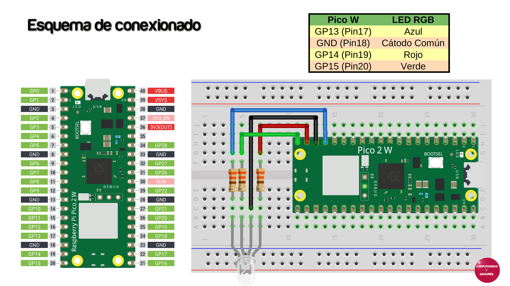

# Cliente-Servidor PC-Raspberry Pi Pico W

Código en MicroPython para el servidor (Raspberry Pi Pico W)
Código en Python para el cliente PC

# Paso a paso

La explicación completa la podrás ver en el siguiente video de YouTube:
https://youtu.be/Px8h9yvIB2E
